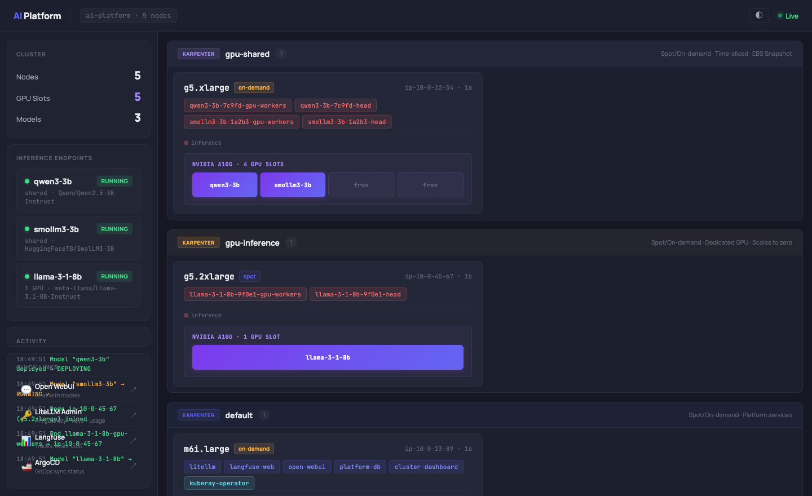

# AI Platform on EKS

**A self-service AI gateway for your own AWS account.** One OpenAI-compatible API
fronts every model — Amazon Bedrock, any HuggingFace model, and your fine-tuned
ones — with per-team keys, budgets, and rate limits. Teams ship models the way
they ship code: commit a short YAML, `git push`, and the platform handles GPU
provisioning, serving, routing, and observability. A frontier model
(**Bedrock Claude Opus 4.8**) works on day one with **zero GPUs**.

**Two things make it work:**

- **One gateway, every model.** LiteLLM puts Bedrock, vLLM-served open models, and
  fine-tuned models behind a single `/v1/chat/completions` endpoint — with team
  isolation, budgets, and Langfuse tracing built in.
- **Proven, extendable templates.** Four [KRO](https://kro.run) resources
  (`VLLMEndpoint`, `LLMDEndpoint`, `AITeam`, `FineTuneJob`)
  capture the hard parts — tensor-parallelism, GPU sizing, elastic autoscaling,
  scale-tier routing, fine-tune→deploy — as a few lines of YAML. They're the
  platform's API: fork and extend them, don't reinvent them.

**Stack:** EKS Managed Capabilities (ArgoCD · KRO · ACK) · Karpenter · vLLM ·
LiteLLM · Langfuse — with an optional **llm-d + Gateway API Inference
Extension** scale tier.



---

## Architecture

```
git push → ArgoCD syncs → KRO expands your YAML into K8s + AWS resources
         → Karpenter provisions a GPU node → vLLM loads the model
         → LiteLLM registers it → available via API, Open WebUI, and Langfuse
```

The custom resources **are** the self-service interface:

| Resource | What it does |
|---|---|
| **`VLLMEndpoint`** | Serve a model on vLLM — the simple default: one model, one pod, one instance (HuggingFace ID, or a fine-tuned model from S3) |
| **`LLMDEndpoint`** | Serve a model on the llm-d scale tier — KV-cache/load/prefix-aware routing across replicas (opt-in; needs the `inference_gateway` capability) |
| **`AITeam`** | Onboard a team: namespace, RBAC, budget, rate limits, scoped API key |
| **`FineTuneJob`** | QLoRA fine-tune (Unsloth), optionally `autoDeploy` the result |

```yaml
# That's the whole interface — e.g. serve a model:
apiVersion: kro.run/v1alpha1
kind: VLLMEndpoint
metadata: { name: qwen3-3b, namespace: inference }
spec:
  model: "Qwen/Qwen2.5-3B-Instruct"   # ungated — no token needed
  gpuCount: 1                          # 1/2/4/8 → vLLM tensor parallelism
  shared: false                        # true → time-slice one GPU across up to 4 small models
```

Bedrock models need no resource — they're a few lines of LiteLLM config, live the
moment the cluster is up. KRO definitions live in `platform/config/kro/`; extend
them there and every model/team inherits the change.

**Two serving tiers, one front door.** Every model — Bedrock and self-hosted
(`VLLMEndpoint`, the simple default) — answers through the same LiteLLM `/v1` API
(governance, budgets, tracing). For high-throughput workloads an optional **llm-d**
scale tier (`LLMDEndpoint`) adds KV-cache-, prefix-, and load-aware routing across
replicas (via the Gateway API Inference Extension); LiteLLM forwards to it
internally, so governance still applies. See **[docs/llm-d-and-ingress-architecture.md](docs/llm-d-and-ingress-architecture.md)**.

---

## Quick start

Provision → use Opus 4.8 with zero GPUs → deploy a self-hosted model → fine-tune →
prove the savings. Mind the prerequisites that matter: fork the repo, set the IP
allowlist, and supply gated-model tokens where needed. The shape of it:

> ⚠️ **Before you deploy — this creates real, billable infrastructure in your AWS
> account.** It provisions an EKS cluster and (on demand) GPU nodes, and exposes the
> platform UIs behind an **internet-facing ALB**. Restrict access to your own IP
> ranges via the **IP allowlist** before applying — never leave it open to the public
> internet (`0.0.0.0/0`). GPU nodes and the cluster incur significant cost; use
> [Tear down](#tear-down) to remove everything when finished. See
> [SECURITY.md](SECURITY.md).


```bash
# 1. Configure: copy a tfvars, set your Identity Center ARN + gitops repo URL.
cd terraform/00.global/vars && cp example.tfvars dev.tfvars   # set ARN + gitops repo URL

# 2. Provision everything (VPC → EKS + capabilities → Karpenter → secrets).
export AWS_REGION=eu-central-1
./platformctl up dev

# 3. Use it immediately — no GPUs yet.
./platformctl tunnel        # forward the UIs (WebUI / LiteLLM / Langfuse)
./platformctl preflight     # verify Bedrock + models answer AND Langfuse tracing works

# 4. Deploy a self-hosted model — commit a YAML and push.
cp workloads/models/TEMPLATE.yaml.example workloads/models/qwen3-3b.yaml
# edit: set name + model (e.g. Qwen/Qwen2.5-3B-Instruct), then:
git add workloads/models/qwen3-3b.yaml && git commit -m "feat: deploy qwen3-3b" && git push
kubectl get vllmendpoints -n inference -w
```

`./platformctl` is a thin wrapper over `make` + `ops/` (`up · status · tunnel ·
preflight · compare · down`). The UIs sit behind one internet-facing ALB
(Open WebUI `:8080` · LiteLLM `:4000` · Langfuse `:3000` · Dashboard `:9090`),
IP-allowlisted — or reach them from anywhere with `./platformctl tunnel`.

---

## Beyond the basics

**Prove small + fine-tuned beats big.** Run the same eval set through the frontier
model, a base small model, and a fine-tuned small model — Langfuse shows the tuned
3B matching Opus 4.8 on a narrow task at a fraction of the cost, and the script
prints the **cost crossover** (daily volume above which self-hosting wins):

```bash
./platformctl compare    # → ops/compare-models.py, traced as a Langfuse dataset run
```

Fine-tune with the same `git push` loop: upload a dataset, commit a `FineTuneJob`
with `autoDeploy: true`, and the tuned model goes live as an endpoint.

**Scale-tier routing (llm-d).** For high-QPS or long, multi-turn/agentic
workloads, commit an `LLMDEndpoint` (see `workloads/scale-models/`) and the
optional llm-d tier schedules requests across vLLM replicas using live KV-cache,
prefix, and queue-depth signals, and supports prefill/decode disaggregation. Architecture and the ALB-vs-Envoy ingress decision are in
**[docs/llm-d-and-ingress-architecture.md](docs/llm-d-and-ingress-architecture.md)**;
disaggregation roadmap in **[docs/roadmap/disaggregated-inference.md](docs/roadmap/disaggregated-inference.md)**.

**Fast cold starts.** New GPU deployments avoid the multi-minute cold start via
three layers: EBS image snapshots (0s image pull), SOCI lazy-loading, and an S3
model-weight cache (~15s load vs ~60s from HuggingFace). All automated by Terraform.

**Platform Health Agent.** The cluster dashboard can watch for failures, investigate
them with an LLM, and propose a one-click fix — idle until you provide a Kiro key.
See **[its guide](platform/services/cluster-dashboard/PLATFORM-HEALTH-AGENT.md)**.

**Cost control.** Karpenter right-sizes and consolidates GPU nodes to match demand
and reclaims them when workloads are removed; `shared: true` time-slices one
physical GPU across up to 4 small models.

**Presenting it?** [docs/demo-walkthrough.md](docs/demo-walkthrough.md) is a timed
presenter's script (10/20/30-min cuts) with talk track and fallbacks.

---

## Tear down

```bash
./platformctl down <env>          # → make destroy-all ENVIRONMENT=<env>
                                  #   prompts you to type the env name to confirm
```

`destroy-all` walks the six terraform stages in reverse
(`oss-obs → native-obs → addons → cluster → iam → networking`). On a healthy
cluster that has been idle, it finishes in ~25 minutes. On a cluster that's
been actively running models, expect **30–45 min** and a few hand-cleanup
steps below. The script does **not** touch the bootstrap state (S3
`tfstate-<account>` + DynamoDB `tfstate-lock`), so a subsequent
`./platformctl up <env>` still works.

### Run this *before* `down` (avoids the gotchas)

```bash
# 1. Drain the cluster from the gitops side so destroy doesn't race ArgoCD.
kubectl delete applicationset --all -n argocd --wait=false
kubectl delete application    --all -n argocd --wait=false
kubectl delete inferenceendpoints,vllmendpoints,llmdendpoints,aiteams,finetunejobs --all -A --wait=false
kubectl delete ingress --all -A --wait=false      # → ALB controller cleans up the ALB

# 2. Empty the training-datasets bucket (force_destroy=false by design — real
#    user data lives there. Skipping this makes the cluster destroy fail.)
aws s3 rm "s3://$(terraform -chdir=terraform/30.eks/30.cluster output -raw cluster_name)-training-datasets" --recursive
# If versioning is enabled (it is, by default), purge versions + delete markers too:
aws s3api delete-objects --bucket "<cluster>-training-datasets" \
    --delete "$(aws s3api list-object-versions --bucket "<cluster>-training-datasets" \
                --query='{Objects: Versions[].{Key:Key,VersionId:VersionId}}')" 2>/dev/null || true

# 3. Empty the unsloth-trainer ECR repo (also force_delete=false by design):
aws ecr batch-delete-image --repository-name "<cluster>/unsloth-trainer" \
    --image-ids "$(aws ecr list-images --repository-name "<cluster>/unsloth-trainer" \
                   --query 'imageIds[*]' --output json)" 2>/dev/null || true

./platformctl down <env>
```

### Run this *after* `down` (mop up orphans)

Several resources legitimately escape Terraform's reach because they're
created by **in-cluster controllers** rather than Terraform. Sweep them once
the destroy returns:

| What | Why it leaks | Fix |
|---|---|---|
| Karpenter-spawned EC2 instances | Karpenter is destroyed before it can drain its own NodeClaims. The leftover instance pins a subnet → VPC destroy hangs ~18 min. | `aws ec2 terminate-instances --instance-ids $(aws ec2 describe-instances --filters Name=vpc-id,Values=<vpc> Name=instance-state-name,Values=running --query 'Reservations[].Instances[].InstanceId' --output text)` |
| ALB controller security group (`k8s-traffic-*`) and EKS cluster security group | Created by the ALB controller / EKS, not Terraform. Pin the VPC. | `aws ec2 delete-security-group --group-id <id>` for each non-default SG in the VPC |
| Orphaned EBS volumes from PVCs | When you force-strip namespace finalizers (needed if `networking.k8s.aws/resources` finalizers hang on stale NetworkPolicies), the PV→PVC→volume reclaim chain breaks. ~20 small volumes get left in `available`. | `aws ec2 delete-volume --volume-id <id>` for each volume with cluster tags |
| SOCI/data-volume EBS snapshot | Created out-of-band by `ops/create-data-volume-snapshot.sh`. Never tracked by terraform. | `aws ec2 delete-snapshot --snapshot-id <id>` |
| Unassociated EIPs | Released cleanly only if NAT GW destruction was clean; can leak if the destroy hit a timeout. | `aws ec2 release-address --allocation-id <id>` |
| CloudWatch log groups (`/aws/containerinsights/<cluster>/...`) | CloudWatch Container Insights addon writes outside Terraform's view. | `aws logs delete-log-group --log-group-name <name>` |

### Things you'll hit (and the cause)

* **`Error acquiring the state lock`** — a previous `terraform` run was
  killed mid-flight. Find the lock ID in the error and run
  `terraform -chdir=terraform/<stage> force-unlock -force <id>`.
* **`kubernetes_namespace.ai_platform: Still destroying...`** for many
  minutes — a `NetworkPolicy` finalizer (`networking.k8s.aws/resources`)
  is waiting for the VPC CNI controller, which has already been destroyed.
  Strip the finalizers manually:
  `kubectl get networkpolicies -n ai-platform -o name | xargs -I {} kubectl patch -n ai-platform {} --type=merge -p '{"metadata":{"finalizers":[]}}'`
* **`ECR Repository ... not empty`** — empty it with `aws ecr batch-delete-image`, then re-run.
* **Subnet stuck destroying for 15+ min** — almost always an orphan
  Karpenter EC2 instance. See the table above.

When in doubt, the final state should match this:

```bash
# Should return empty for the env you destroyed:
aws eks list-clusters --query 'clusters[?contains(@, `<env>`)]'
aws ec2 describe-vpcs --filters "Name=tag:Environment,Values=<env>" --query 'Vpcs[].VpcId'
aws s3 ls | grep "<env>"
aws iam list-roles --query "Roles[?contains(RoleName, '<cluster-name>')].RoleName"
```

---

## Repository layout

```
argocd/bootstrap/   ApplicationSets (platform services + self-service workloads)
platform/
  config/kro/       VLLMEndpoint · LLMDEndpoint · AITeam · FineTuneJob (the API)
  services/         litellm, open-webui, langfuse, gpu-operator,
                    cluster-dashboard (+ Platform Health Agent), inference-gateway
  images/           Container build contexts (unsloth-trainer, platform-controller)
workloads/          Self-service YAMLs: models/ · scale-models/ · teams/ · fine-tuning/
ops/                Operational scripts (ops/demo/ holds demo-only scripts)
terraform/          Infrastructure modules (VPC → IAM → EKS → observability)
docs/               demo-walkthrough · platform-product-report ·
                    llm-d-and-ingress-architecture · roadmap/
```

## Acknowledgments

Infrastructure based on [Automated Provisioning of Application-Ready Amazon EKS Clusters](https://aws-solutions-library-samples.github.io/compute/automated-provisioning-of-application-ready-amazon-eks-clusters.html)
from the AWS Solutions Library, extended with EKS Managed Capabilities,
GPU-optimized Karpenter NodePools, and the self-service AI platform layer.
